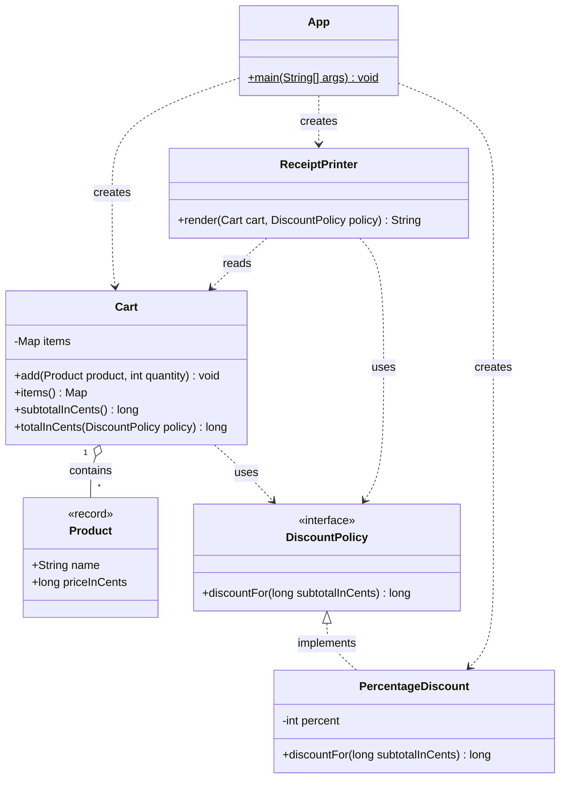

# Class diagram

UML class diagram of the `cart-app` project, written in [Mermaid](https://mermaid.js.org/).

```mermaid
classDiagram
  class App {
    +main(String[] args)$ void
  }
  class Cart {
    -Map items
    +add(Product product, int quantity) void
    +items() Map
    +subtotalInCents() long
    +totalInCents(DiscountPolicy policy) long
  }
  class Product {
    <<record>>
    +String name
    +long priceInCents
  }
  class DiscountPolicy {
    <<interface>>
    +discountFor(long subtotalInCents) long
  }
  class PercentageDiscount {
    -int percent
    +discountFor(long subtotalInCents) long
  }
  class ReceiptPrinter {
    +render(Cart cart, DiscountPolicy policy) String
  }

  DiscountPolicy <|.. PercentageDiscount : implements
  Cart "1" o-- "*" Product : contains
  Cart ..> DiscountPolicy : uses
  ReceiptPrinter ..> Cart : reads
  ReceiptPrinter ..> DiscountPolicy : uses
  App ..> Cart : creates
  App ..> ReceiptPrinter : creates
  App ..> PercentageDiscount : creates
```
